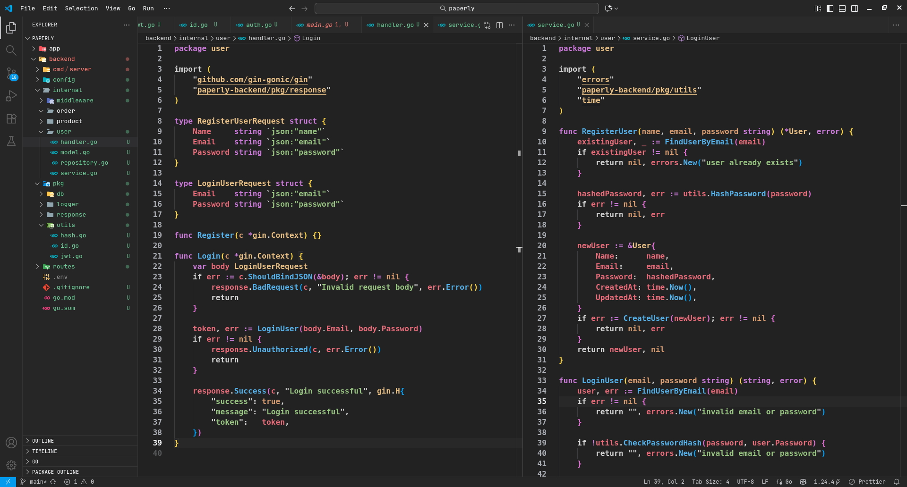

# Unsafe Dark

A sleek, modern dark theme for Visual Studio Code inspired by contemporary design principles. Features neutral backgrounds with carefully chosen accent colors for optimal readability and professional aesthetics.

## Features

- **Neutral Dark Backgrounds**: Clean, professional interface using consistent neutral grays
- **Consistent UI**: Unified color scheme across all VS Code interface elements

## Installation

1. Open Visual Studio Code (or any VS Code fork such as VSCodium)
2. Go to Extensions (Ctrl+Shift+X)
3. Search for "Unsafe Dark"
4. Click Install
5. Go to File > Preferences > Color Theme
6. Select "Unsafe Dark"

## Screenshot

## Development

This theme is designed with the following principles:
- Minimal visual distraction
- Professional appearance
- Excellent code readability
- Consistent design language

---

**Enjoy coding with Unsafe Dark!**

Developed by **UnsafeZero** - [priyanxhu.me](https://priyanxhu.me)