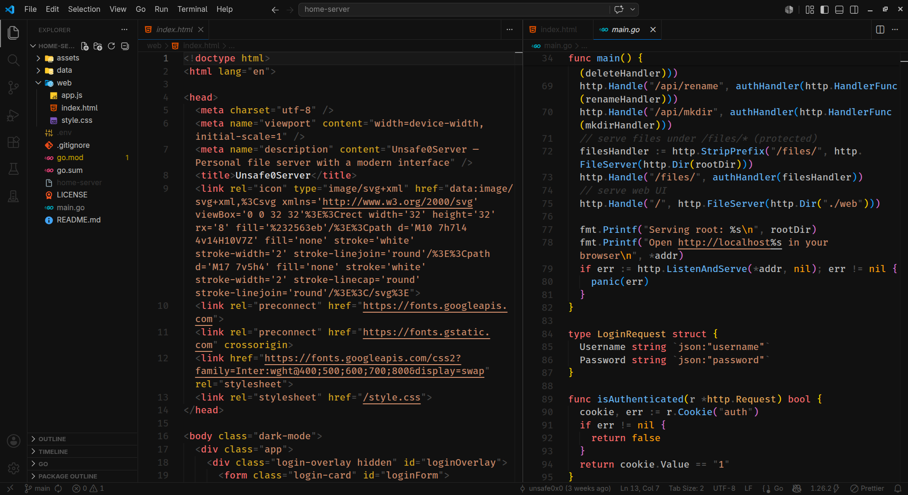

# Unsafe Dark

A sleek, modern dark theme for Visual Studio Code inspired by contemporary design principles.

## Installation

1. Open Visual Studio Code
2. Go to Extensions (Ctrl+Shift+X)
3. Search for "Unsafe Dark"
4. Click Install
5. Go to File > Preferences > Color Theme
6. Select "Unsafe Dark"

## Features

- Neutral dark backgrounds with professional design
- Unified color scheme across VS Code interface
- Optimized for readability and minimal distraction

